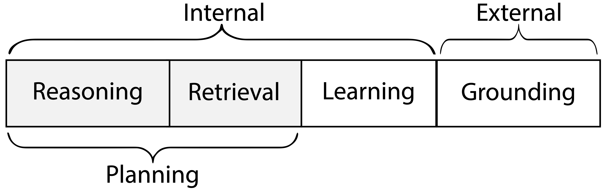
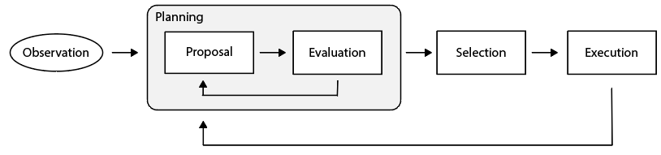

# 🐨CoALA: Awesome Language Agents
[](https://awesome.re) [](LICENSE)  [](https://github.com/ysymyth/awesome-language-agents/pulls)


A compilation of language agents using the **Cognitive Architectures for Language Agents (🐨CoALA)** framework. 
- CoALA Paper (16 pages of main content): https://arxiv.org/abs/2309.02427
- CoALA Tweet (6 threads): https://twitter.com/ShunyuYao12/status/1699396834983362690
- CoALA BibTex file with 300+ related citations: [CoALA.bib](CoALA.bib)
- CoALA BibTex citation if you find our work/resources useful:
```bibtex
@misc{sumers2023cognitive,
      title={Cognitive Architectures for Language Agents}, 
      author={Theodore Sumers and Shunyu Yao and Karthik Narasimhan and Thomas L. Griffiths},
      year={2023},
      eprint={2309.02427},
      archivePrefix={arXiv},
      primaryClass={cs.AI}
}
```

## 🐨CoALA Overview
CoALA neatly specifies a language agent starting with its **action space**, which has 2 parts:
* External actions to interact with external environments (**grounding**)
* Internal actions to interact with internal memories (**reasoning**, **retrieval**, **learning**)
  * A language agent has a short-term working memory and several (optional) long-term memories (episodic for experience, semantic for knowledge, procedural for code/LLM)
  * **Reasoning** = update working memory (with LLM)
  * **Retrieval** = read long-term memory
  * **Learning** = write long-term memory



Then how does a language agent choose which action to take? Its actions are structured into **decision making** cycles, and each cycle has two stages:
* **Planning**: The agent applies reasoning/retrieval actions to (iteratively) propose and evaluate actions, then select a learning/grounding action.
* **Execution**: The selected learning/grounding action is executed to affect the internal memory or external world.


To understand more, read Section 4 of our [paper](https://arxiv.org/abs/2309.02427).

## Papers
Below is only a subset of papers scraped from [CoALA.bib](CoALA.bib) plus pulled requests, with potentially incorrect action space labels. 
Date is based on arxiv v1. They do not represent all language agent work, and we plan to add more work soon (pull requests welcome), and have labels for highly cited work.

* (2021-10) [AI Chains: Transparent and Controllable Human-AI Interaction by Chaining Large Language Model Prompts](http://arxiv.org/abs/2110.01691) (reasoning)
* (2021-10) [SILG: The Multi-environment Symbolic Interactive Language Grounding Benchmark](http://arxiv.org/abs/2110.10661) (environment)
* (2022-01) [Language Models as Zero-Shot Planners: Extracting Actionable Knowledge for Embodied Agents](http://arxiv.org/abs/2201.07207) (grounding)
* (2022-03) [PromptChainer: Chaining Large Language Model Prompts through Visual Programming](http://arxiv.org/abs/2203.06566) (grounding)
* (2022-03) [ScienceWorld: Is your Agent Smarter than a 5th Grader?](http://arxiv.org/abs/2203.07540) (environment)
* (2022-04) [Do As I Can, Not As I Say: Grounding Language in Robotic Affordances](http://arxiv.org/abs/2204.01691) (grounding)
* (2022-04) [Socratic Models: Composing Zero-Shot Multimodal Reasoning with Language](http://arxiv.org/abs/2204.00598) (grounding)
* (2022-07) [WebShop: Towards Scalable Real-World Web Interaction with Grounded Language Agents](http://arxiv.org/abs/2207.01206) (environment)
* (2022-09) [ProgPrompt: Generating Situated Robot Task Plans using Large Language Models](http://arxiv.org/abs/2209.11302) (grounding)
* (2022-10) [Decomposed Prompting: A Modular Approach for Solving Complex Tasks](http://arxiv.org/abs/2210.02406) (reasoning)
* (2022-10) [Mind's Eye: Grounded Language Model Reasoning through Simulation](http://arxiv.org/abs/2210.05359) (grounding)
* (2022-10) [ReAct: Synergizing Reasoning and Acting in Language Models](http://arxiv.org/abs/2210.03629) (grounding, reasoning)
* (2022-11) [Large Language Models Are Human-Level Prompt Engineers](http://arxiv.org/abs/2211.01910) (reasoning)
* (2022-12) [LLM-Planner: Few-Shot Grounded Planning for Embodied Agents with Large Language Models](https://arxiv.org/abs/2212.04088) (grounding)
* (2022-12) [Don’t Generate, Discriminate: A Proposal for Grounding Language Models to Real-World Environments](https://aclanthology.org/2023.acl-long.270/) (grounding)
* (2023-02) [Chain of Hindsight Aligns Language Models with Feedback](http://arxiv.org/abs/2302.02676v6) (learning)
* (2023-02) [Describe, Explain, Plan and Select: Interactive Planning with Large Language Models Enables Open-World Multi-Task Agents](http://arxiv.org/abs/2302.01560) (grounding, reasoning)
* (2023-02) [Toolformer: Language Models Can Teach Themselves to Use Tools](http://arxiv.org/abs/2302.04761) (grounding)
* (2023-03) [Foundation Models for Decision Making: Problems, Methods, and Opportunities](http://arxiv.org/abs/2303.04129) (survey)
* (2023-03) [HuggingGPT: Solving AI Tasks with ChatGPT and its Friends in Hugging Face](http://arxiv.org/abs/2303.17580) (grounding)
* (2023-03) [PaLM-E: An Embodied Multimodal Language Model](http://arxiv.org/abs/2303.03378) (grounding)
* (2023-03) [Reflexion: Language Agents with Verbal Reinforcement Learning](http://arxiv.org/abs/2303.11366) (grounding, reasoning, learning)
* (2023-03) [Self-Refine: Iterative Refinement with Self-Feedback](http://arxiv.org/abs/2303.17651) (reasoning)
* (2023-03) [Self-planning Code Generation with Large Language Models](http://arxiv.org/abs/2303.06689) (reasoning)
* (2023-04) [Generative Agents: Interactive Simulacra of Human Behavior](https://arxiv.org/abs/2304.03442) (grounding, reasoning, retrieval, learning)
* (2023-04) [Emergent autonomous scientific research capabilities of large language models](http://arxiv.org/abs/2304.05332) (grounding, reasoning)
* (2023-04) [LLM+P: Empowering Large Language Models with Optimal Planning Proficiency](http://arxiv.org/abs/2304.11477) (grounding, reasoning)
* (2023-04) [REFINER: Reasoning Feedback on Intermediate Representations](http://arxiv.org/abs/2304.01904) (reasoning)
* (2023-04) [Teaching Large Language Models to Self-Debug](http://arxiv.org/abs/2304.05128) (reasoning)
* (2023-04) [GeneGPT: Augmenting Large Language Models with Domain Tools for Improved Access to Biomedical Information](https://arxiv.org/abs/2304.09667) (grounding, reasoning)
* (2023-05) [CRITIC: Large Language Models Can Self-Correct with Tool-Interactive Critiquing](https://arxiv.org/pdf/2305.11738.pdf) (grounding, reasoning, retrieval)
* (2023-05) [Augmenting Autotelic Agents with Large Language Models](http://arxiv.org/abs/2305.12487) (grounding, reasoning, retrieval, learning)
* (2023-05) [ChatCoT: Tool-Augmented Chain-of-Thought Reasoning on Chat-based Large Language Models](http://arxiv.org/abs/2305.14323) (grounding, reasoning)
* (2023-05) [ToolkenGPT: Augmenting Frozen Language Models with Massive Tools via Tool Embeddings](https://arxiv.org/abs/2305.11554) (grounding, reasoning)
* (2023-05) [Decomposition Enhances Reasoning via Self-Evaluation Guided Decoding](http://arxiv.org/abs/2305.00633) (reasoning)
* (2023-05) [Encouraging Divergent Thinking in Large Language Models through Multi-Agent Debate](http://arxiv.org/abs/2305.19118) (grounding, reasoning)
* (2023-05) [Improving Factuality and Reasoning in Language Models through Multiagent Debate](http://arxiv.org/abs/2305.14325) (grounding, reasoning)
* (2023-05) [AdaPlanner: Adaptive Planning from Feedback with Language Models](https://arxiv.org/abs/2305.16653) (grounding, retrieval, learning)
* (2023-05) [Plan-and-Solve Prompting: Improving Zero-Shot Chain-of-Thought Reasoning by Large Language Models](http://arxiv.org/abs/2305.04091) (reasoning)
* (2023-05) [ReWOO: Decoupling Reasoning from Observations for Efficient Augmented Language Models](http://arxiv.org/abs/2305.18323) (grounding, reasoning)
* (2023-05) [SwiftSage: A Generative Agent with Fast and Slow Thinking for Complex Interactive Tasks](http://arxiv.org/abs/2305.17390) (grounding, reasoning)
* (2023-05) [Tree of Thoughts: Deliberate Problem Solving with Large Language Models](http://arxiv.org/abs/2305.10601) (reasoning)
* (2023-05) [Voyager: An Open-Ended Embodied Agent with Large Language Models](http://arxiv.org/abs/2305.16291) (grounding, reasoning, retrieval, learning)
* (2023-06) [InterCode: Standardizing and Benchmarking Interactive Coding with Execution Feedback](http://arxiv.org/abs/2306.14898) (grounding, reasoning)
* (2023-06) [ToolQA: A Dataset for LLM Question Answering with External Tools](https://arxiv.org/abs/2306.13304) (grounding)
* (2023-06) [Mind2Web: Towards a Generalist Agent for the Web](http://arxiv.org/abs/2306.06070) (environment)
* (2023-06) [RestGPT: Connecting Large Language Models with Real-World RESTful APIs](http://arxiv.org/abs/2306.06624) (grounding, reasoning)
* (2023-06) [ToolAlpaca: Generalized Tool Learning for Language Models with 3000 Simulated Cases](http://arxiv.org/abs/2306.05301) (grounding, reasoning)
* (2023-07) [A Real-World WebAgent with Planning, Long Context Understanding, and Program Synthesis](http://arxiv.org/abs/2307.12856) (grounding, reasoning)
* (2023-07) [RT-2: Vision-Language-Action Models Transfer Web Knowledge to Robotic Control](http://arxiv.org/abs/2307.15818) (grounding)
* (2023-07) [RoCo: Dialectic Multi-Robot Collaboration with Large Language Models](http://arxiv.org/abs/2307.04738) (grounding)
* (2023-07) [Robots That Ask For Help: Uncertainty Alignment for Large Language Model Planners](http://arxiv.org/abs/2307.01928) (grounding)
* (2023-07) [S$^3$: Social-network Simulation System with Large Language Model-Empowered Agents](http://arxiv.org/abs/2307.14984) (grounding, reasoning)
* (2023-07) [ToolLLM: Facilitating Large Language Models to Master 16000+ Real-world APIs](http://arxiv.org/abs/2307.16789) (grounding, reasoning, retrieval)
* (2023-07) [Understanding the Benefits and Challenges of Using Large Language Model-based Conversational Agents for Mental Well-being Support](http://arxiv.org/abs/2307.15810) (grounding)
* (2023-07) [Unleashing Cognitive Synergy in Large Language Models: A Task-Solving Agent through Multi-Persona Self-Collaboration](http://arxiv.org/abs/2307.05300) (grounding, reasoning)
* (2023-07) [WebArena: A Realistic Web Environment for Building Autonomous Agents](http://arxiv.org/abs/2307.13854) (environment)
* (2023-08) [AgentBench: Evaluating LLMs as Agents](http://arxiv.org/abs/2308.03688) (environment)
* (2023-08) [AgentVerse: Facilitating Multi-Agent Collaboration and Exploring Emergent Behaviors in Agents](http://arxiv.org/abs/2308.10848) (environment)
* (2023-08) [AutoGen: Enabling Next-Gen LLM Applications via Multi-Agent Conversation Framework](http://arxiv.org/abs/2308.08155) (grounding, reasoning)
* (2023-08) [CGMI: Configurable General Multi-Agent Interaction Framework](http://arxiv.org/abs/2308.12503) (grounding, reasoning)
* (2023-08) [ChatEval: Towards Better LLM-based Evaluators through Multi-Agent Debate](http://arxiv.org/abs/2308.07201) (grounding, reasoning)
* (2023-08) [Cumulative Reasoning with Large Language Models](http://arxiv.org/abs/2308.04371) (reasoning)
* (2023-08) [ExpeL: LLM Agents Are Experiential Learners](https://arxiv.org/abs/2308.10144) (grounding, reasoning, retrieval, learning)
* (2023-08) [GPT-in-the-Loop: Adaptive Decision-Making for Multiagent Systems](http://arxiv.org/abs/2308.10435) (grounding, reasoning)
* (2023-08) [Gentopia: A Collaborative Platform for Tool-Augmented LLMs](http://arxiv.org/abs/2308.04030) (environment)
* (2023-08) [MetaGPT: Meta Programming for Multi-Agent Collaborative Framework](http://arxiv.org/abs/2308.00352) (grounding, reasoning)
* (2023-08) [ProAgent: Building Proactive Cooperative AI with Large Language Models](http://arxiv.org/abs/2308.11339) (grounding, reasoning)
* (2023-08) [Retroformer: Retrospective Large Language Agents with Policy Gradient Optimization](http://arxiv.org/abs/2308.02151) (grounding, reasoning, learning)
* (2023-08) [SAPIEN: Affective Virtual Agents Powered by Large Language Models](http://arxiv.org/abs/2308.03022) (grounding, reasoning)
* (2023-08) [Synergistic Integration of Large Language Models and Cognitive Architectures for Robust AI: An Exploratory Analysis](http://arxiv.org/abs/2308.09830) (grounding, reasoning, retrieval, learning)
* (2023-09) [ToRA: A Tool-Integrated Reasoning Agent for Mathematical Problem Solving](https://arxiv.org/abs/2309.17452) (grounding, reasoning, learning)
* (2023-09) [Identifying the Risks of LM Agents with an LM-Emulated Sandbox](https://arxiv.org/abs/2309.15817) (environment)
* (2023-09) [Suspicion Agent: Playing Imperfect Information Games with Theory of Mind Aware GPT-4](http://arxiv.org/abs/2309.17277) (grounding, reasoning)
* (2024-03) [LLM3:Large Language Model-based Task and Motion Planning with Motion Failure Reasoning.](https://arxiv.org/abs/2403.11552) (planning, reasoning)
* (2024-04) [Empowering Biomedical Discovery with AI Agents](https://arxiv.org/abs/2404.02831) (AI scientist, biomedical research)


(more to be added soon. pull request welcome.)

## Resources
* [LLM Powered Autonomous Agents (Lil’Log)](https://lilianweng.github.io/posts/2023-06-23-agent/)
* [LLM-Agents-Papers](https://github.com/AGI-Edgerunners/LLM-Agents-Papers)
* [LLMAgentPapers](https://github.com/zjunlp/LLMAgentPapers)
* [awesome-llm-powered-agent](https://github.com/hyp1231/awesome-llm-powered-agent)
  
(more to be added soon. pull request welcome.)
